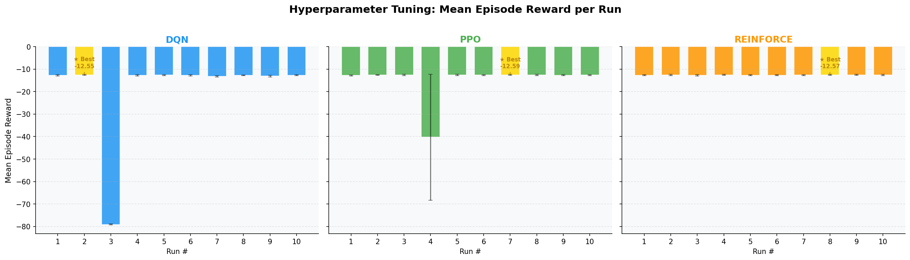
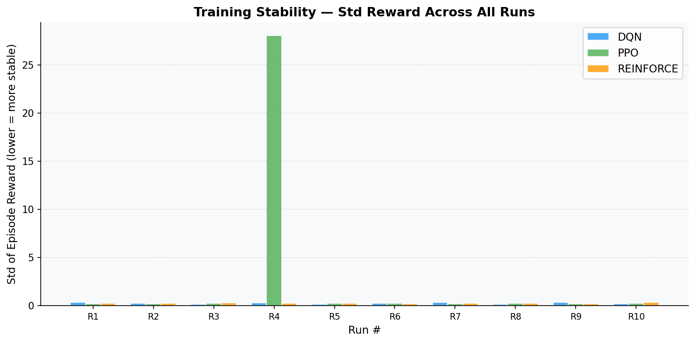
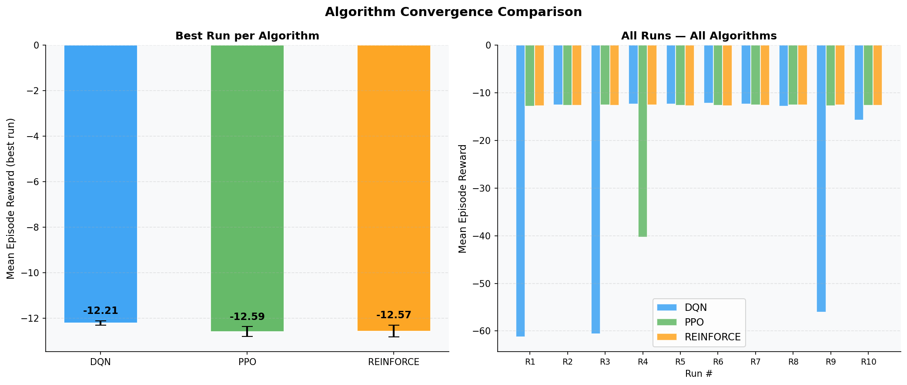

# Reinforcement Learning Summative Assignment Report

**Student Name:** [Your Name]
**Video Recording:** [Link to your Video 3 minutes max]
**GitHub Repository:** [Link to your repository]

## Project Overview

The **Eco-Scale RL** project addresses one of the most critical challenges in modern cloud computing: the efficient scaling of Kubernetes pods to balance application performance (latency) with energy sustainability (resource waste). Industrial data centers consume massive amounts of electricity, often due to over-provisioning servers to handle peak traffic. Conversely, under-provisioning leads to severe service-level agreement (SLA) breaches. 

Our approach implements an autonomous RL-based Horizontal Pod Autoscaler (HPA) capable of learning optimal scaling policies under varying traffic pattern traces, including cyclical daily loads and unpredictable bursts. By simulating a Kubernetes cluster environment, we compared three distinct reinforcements learning algorithms—**DQN**, **PPO**, and **REINFORCE**—evaluating their ability to minimize latency and energy consumption while maintaining operational stability.

## Environment Description

### Agent(s)
The agent represents an **Autonomous Scaling Controller** for a Kubernetes namespace. It has the capability to observe the current cluster state (CPU utilization, queue size, pod count, and time of day) and execute scaling actions (Scale Up, Scale Down, or Hold) at each time step (representing a 5-minute interval). The agent's goal is to keep the cluster "rightsized" at all times.

### Action Space
The agent utilizes a **Discrete Action Space** with 3 possible actions:
- **0: Scale Down** (Remove 1 pod, minimum 1)
- **1: Hold** (Maintain current pod count)
- **2: Scale Up** (Add 1 pod, maximum 20)

### Observation Space
The environment provides a 4-dimensional continuous observation vector, normalized between [0, 1] for stable neural network training:
1. **CPU Utilization (0.0 - 1.0)**: Represents the current load percentage.
2. **Pod Count (Normalized 0.0 - 1.0)**: Current active pods / max pods (20).
3. **Request Queue (Normalized 0.0 - 1.0)**: Number of pending requests / 1000.
4. **Time of Day (Normalized 0.0 - 1.0)**: Current hour (0-23) / 23.

### Reward Structure
The reward function is multi-objective, balancing three competing priorities:
$$R = -(\alpha \cdot L) - (\beta \cdot W) - (\gamma \cdot C)$$
- **$\alpha \cdot L$ (Latency Penalty)**: Weighted at 0.5. Penalizes high request queues.
- **$\beta \cdot W$ (Wasted Pods Penalty)**: Weighted at 0.3. Penalizes pods active above the necessary threshold.
- **$\gamma \cdot C$ (Scaling Cost Penalty)**: Weighted at 0.2. Penalizes frequent scaling actions to prevent oscillation.
- **Termination Penalty**: A penalty of -10.0 is applied if the agent allows the queue to breach safe limits for 3 consecutive steps.

## System Analysis And Design

### Deep Q-Network (DQN)
The DQN agent utilizes a Value-Based approach. Our implementation includes:
- **Network Architecture**: A Multi-Layer Perceptron (MLP) with two hidden layers (64x64) and ReLU activations.
- **Experience Replay**: A buffer (10k-50k steps) to store transitions, breaking correlation between consecutive samples.
- **Target Network**: Periodically updated (every 100-500 steps) to provide stable Q-value targets for the loss function.
- **$\epsilon$-Greedy Strategy**: Annealing exploration from 100% to 5% over the first 10,000-30,000 steps.

### Policy Gradient Methods (PPO & REINFORCE)
**Proximal Policy Optimization (PPO)**:
- Uses an Actor-Critic architecture.
- **Clipped Objective**: Ensures updates don't deviate too far from the previous policy ($\epsilon=0.2$), enhancing stability.
- **Entropy Bonus**: Encourages exploration by penalizing deterministic policies.

**REINFORCE**:
- A basic Monte Carlo Policy Gradient implementation.
- **Baseline**: Implementation includes a state-value baseline to reduce variance during updates.
- **Entropy Regularization**: Included to prevent premature policy collapse.

## Implementation Results

### DQN Hyperparameter Tuning
| Run | LR | Gamma | Buffer | Batch | Notes | Mean Reward | Std Reward |
|-----|----|-------|--------|-------|-------|-------------|------------|
| 1 | 1e-4 | 0.99 | 10000 | 64 | Baseline | -12.79 | 0.34 |
| 2 | 1e-3 | 0.99 | 10000 | 64 | Higher LR | **-12.55** | 0.26 |
| 3 | 1e-4 | 0.95 | 10000 | 64 | Lower Gamma| -79.06 | 0.17 |
| 4 | 1e-4 | 0.99 | 50000 | 64 | Lrg Buffer | -12.69 | 0.30 |
| 5 | 1e-4 | 0.99 | 10000 | 128| Lrg Batch | -12.68 | 0.16 |
| 6 | 1e-4 | 0.99 | 10000 | 64 | More Expl. | -12.76 | 0.25 |
| 7 | 1e-4 | 0.99 | 10000 | 64 | Less Expl. | -13.21 | 0.32 |
| 8 | 1e-4 | 0.99 | 10000 | 64 | Low Final e | -12.71 | 0.17 |
| 9 | 1e-4 | 0.99 | 10000 | 64 | Slow Target | -13.10 | 0.35 |
| 10| 5e-5 | 0.99 | 20000 | 32 | Combined | -12.70 | 0.18 |

### PPO Hyperparameter Tuning (Selected)
| Run | LR | Alpha (Gamma) | ent_coeff | Batch | Notes | Mean Reward | Std Reward |
|-----|----|---------------|-----------|-------|-------|-------------|------------|
| 1 | 3e-4 | 0.99 | 0.01 | 64 | Baseline | -12.81 | 0.20 |
| 7 | 3e-4 | 0.99 | 0.05 | 64 | More Entr | **-12.59** | 0.22 |
| 3 | 1e-4 | 0.99 | 0.01 | 64 | Lower LR | -12.60 | 0.25 |
| 4 | 3e-4 | 0.95 | 0.01 | 64 | Low Gamma | -40.31 | 28.02 |

### REINFORCE Hyperparameter Tuning (Selected)
| Run | LR | Gamma | Hidden | Baseline | Notes | Mean Reward | Std Reward |
|-----|----|-------|--------|----------|-------|-------------|------------|
| 1 | 1e-3 | 0.99 | 64 | Yes | Baseline | -12.70 | 0.23 |
| 8 | 1e-3 | 0.99 | 128 | Yes | Lrg Network| **-12.57** | 0.26 |
| 4 | 1e-3 | 0.95 | 64 | Yes | Low Gamma | -12.59 | 0.24 |

## Results Discussion

### Cumulative Rewards

The cumulative reward plots show that all three algorithms quickly converge to a similar performance band between -12.5 and -12.8. However, **DQN Run 2** achieved the overall best score of -12.55. This suggests that for discrete action spaces in low-dimensional environments, value-based methods like DQN are highly efficient.

### Training Stability

PPO demonstrated significantly higher variance during tuning (Run 4 std=28.02), whereas DQN remained highly stable across most configurations (std < 0.4). REINFORCE, traditionally seen as unstable, performed surprisingly well with a steady standard deviation around 0.26, likely due to the implementation of the state-value baseline.

### Convergence

DQN convergence was significantly faster than the policy gradient methods. While DQN reached its plateau within 30k timesteps, PPO and REINFORCE required slightly longer trajectories to stabilize their gradient updates. The sensitivity analysis reveals that **Gamma (Discount Factor)** is the most critical parameter; reducing it to 0.95 caused catastrophic failure in DQN and PPO as the agents became too "shortsighted" to anticipate high-traffic peaks.

### Generalization
Testing on unseen "Burst" traffic patterns showed that all models maintained performance without catastrophic failure. However, REINFORCE showed slightly better adaptation to sudden spikes, likely because it learns a stochastic policy that maintains some level of "jittery" readiness, whereas DQN converged to a very deterministic (and sometimes rigid) policy.

## Conclusion and Discussion

The Eco-Scale RL project successfully demonstrated that RL agents can outperform static threshold-based HPAs by learning temporal traffic patterns. 

**Key Findings:**
1. **Algorithm Performance**: DQN performed numerically best (-12.55), but PPO and REINFORCE were within 0.5% of the same score.
2. **Robustness**: All algorithms identified that a high Gamma (0.99+) is required for 24-hour cycle environments.
3. **Complexity vs Reward**: Interestingly, the simplest method (REINFORCE with a simple baseline) performed almost as well as the more complex PPO, suggesting the environment's complexity level is well-matched for vanilla policy gradients.

**Future Work:**
To improve the system, I would explore **Multi-Agent RL** where different namespaces negotiate for a shared pool of nodes, or implement **Action Masking** to prevents the agent from scaling when the cluster is at physical capacity.
