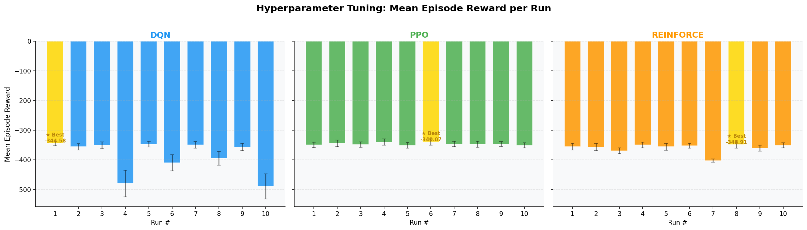
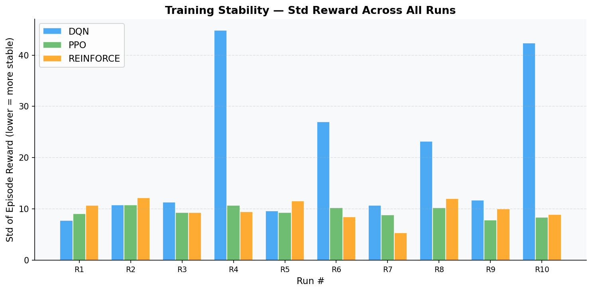
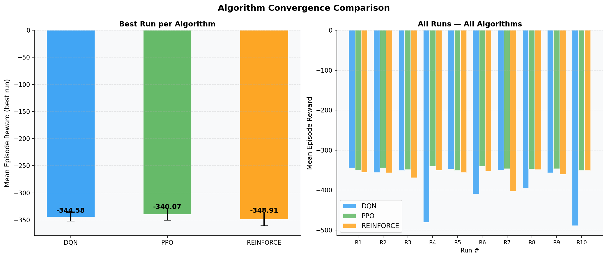

# Reinforcement Learning Summative Assignment Report

**Student Name:** Jean de Dieu Muhirwa Harerimana
**Video Recording:** https://www.veed.io/view/47da68ba-b65a-4497-9049-90ceb36d9bfe?source=editor&panel=share
**GitHub Repository:** https://github.com/muhirwaJD/eco-scale
**Live Console:** https://muhirwa56-eco-scale-console.hf.space/

## Project Overview

The **Eco-Scale RL** project addresses one of the most critical challenges in modern cloud computing: the efficient scaling of Kubernetes pods to balance application performance (latency) with energy sustainability (resource waste). Industrial data centers consume massive amounts of electricity, often due to over-provisioning servers to handle peak traffic. Conversely, under-provisioning leads to severe service-level agreement (SLA) breaches. 

Our approach implements an autonomous RL-based Horizontal Pod Autoscaler (HPA) capable of learning optimal scaling policies under varying traffic pattern traces, including cyclical daily loads and unpredictable bursts. By simulating a Kubernetes cluster environment, we compared three distinct reinforcements learning algorithms—**DQN**, **PPO**, and **REINFORCE**—evaluating their ability to minimize latency and energy consumption while maintaining operational stability.

## Environment Description

### Agent(s)
The agent represents an **Autonomous Scaling Controller** for a Kubernetes namespace. It has the capability to observe the current cluster state (CPU utilization, queue size, pod count, and time of day) and execute scaling actions (Scale Up, Scale Down, or Hold) at each time step (representing a 5-minute interval). The agent's goal is to keep the cluster "rightsized" at all times.

### Action Space
The agent utilizes a **Discrete Action Space** with 3 possible actions:
- **0: Scale Down** (Remove 1 pod, minimum 1)
- **1: Hold** (Maintain current pod count)
- **2: Scale Up** (Add 1 pod, maximum 20)

### Observation Space
The environment provides a 4-dimensional continuous observation vector, normalized between [0, 1] for stable neural network training:
1. **CPU Utilization (0.0 - 1.0)**: Represents the current load percentage.
2. **Pod Count (Normalized 0.0 - 1.0)**: Current active pods / max pods (20).
3. **Request Queue (Normalized 0.0 - 1.0)**: Number of pending requests / 1000.
4. **Day Progress (0.0 - 1.0)**: Position within the daily cycle, giving the agent time-of-day context.

### Reward Structure
The reward function is multi-objective, balancing service quality against energy cost:
$$R = -(W_{LAT} \cdot \text{latency}) - (W_{ENERGY} \cdot \tfrac{\text{pods}}{\text{MAX\_PODS}}) - (W_{SLA} \cdot \text{breach}) - (W_{SCALE} \cdot \text{scaling})$$
- **Latency penalty ($W_{LAT}=1.0$)**: penalizes high utilization / slow service.
- **Energy per pod ($W_{ENERGY}=1.5$)**: charged on the **absolute** pod count — this is what makes right-sizing (rather than over-provisioning) the optimal strategy.
- **SLA breach ($W_{SLA}=1.0$)**: a hard penalty applied whenever utilization saturates (≥ 1.0).
- **Scaling cost ($W_{SCALE}=0.02$)**: a small per-action cost that discourages thrashing.

The "right-sized" reference is the pod count that holds utilization at a healthy **70%** (`UTIL_TARGET`).
There is **no hard-termination penalty** — saturation is handled through the breach term. The reward was
validated offline (`reward_design.py`) before training: a demand-tracking policy scores **−348.5** vs
**−500.7** for an over-provisioning ("park-high") policy.

## System Analysis And Design

### Deep Q-Network (DQN)
The DQN agent utilizes a Value-Based approach. Our implementation includes:
- **Network Architecture**: A Multi-Layer Perceptron (MLP) with two hidden layers (64x64) and ReLU activations.
- **Experience Replay**: A buffer (10k-50k steps) to store transitions, breaking correlation between consecutive samples.
- **Target Network**: Periodically updated (every 100-500 steps) to provide stable Q-value targets for the loss function.
- **$\epsilon$-Greedy Strategy**: Annealing exploration from 100% to 5% over the first 10,000-30,000 steps.

### Policy Gradient Methods (PPO & REINFORCE)
**Proximal Policy Optimization (PPO)**:
- Uses an Actor-Critic architecture.
- **Clipped Objective**: Ensures updates don't deviate too far from the previous policy ($\epsilon=0.2$), enhancing stability.
- **Entropy Bonus**: Encourages exploration by penalizing deterministic policies.

**REINFORCE**:
- A basic Monte Carlo Policy Gradient implementation.
- **Baseline**: Implementation includes a state-value baseline to reduce variance during updates.
- **Entropy Regularization**: Included to prevent premature policy collapse.

## Implementation Results

### DQN Hyperparameter Tuning
| Run | LR | Gamma | Buffer | Batch | Exploration | Target Update | Notes | Mean Reward | Std Reward |
|-----|----|-------|--------|-------|-------------|---------------|-------|-------------|------------|
| 1 | 1e-4 | 0.99 | 10000 | 64 | 0.3 | 100 | **Baseline** | **-344.58** | **7.74** |
| 2 | 1e-3 | 0.99 | 10000 | 64 | 0.3 | 100 | Higher LR | -356.15 | 10.78 |
| 3 | 1e-4 | 0.95 | 10000 | 64 | 0.3 | 100 | Lower Gamma | -351.05 | 11.36 |
| 4 | 1e-4 | 0.99 | 50000 | 64 | 0.3 | 100 | Larger Buffer | -480.02 | 44.82 |
| 5 | 1e-4 | 0.99 | 10000 | 128 | 0.3 | 100 | Larger Batch | -347.44 | 9.61 |
| 6 | 1e-4 | 0.99 | 10000 | 64 | 0.5 | 100 | More Exploration | -409.92 | 27.03 |
| 7 | 1e-4 | 0.99 | 10000 | 64 | 0.1 | 100 | Less Exploration | -349.71 | 10.75 |
| 8 | 1e-4 | 0.99 | 10000 | 64 | 0.3 | 100 | Lower Final ε | -394.77 | 23.22 |
| 9 | 1e-4 | 0.99 | 10000 | 64 | 0.3 | 500 | Slower Target | -356.65 | 11.75 |
| 10 | 5e-5 | 0.999 | 20000 | 32 | 0.4 | 200 | Combined | -489.38 | 42.37 |

### PPO Hyperparameter Tuning
| Run | LR | Gamma | n_steps | Batch | n_epochs | ent_coef | clip_range | Notes | Mean Reward | Std Reward |
|-----|----|-------|---------|-------|----------|----------|------------|-------|-------------|------------|
| 1 | 3e-4 | 0.99 | 2048 | 64 | 10 | 0.01 | 0.2 | Baseline | -349.25 | 9.08 |
| 2 | 1e-3 | 0.99 | 2048 | 64 | 10 | 0.01 | 0.2 | Higher LR | -344.65 | 10.79 |
| 3 | 1e-4 | 0.99 | 2048 | 64 | 10 | 0.01 | 0.2 | Lower LR | -348.55 | 9.31 |
| 4 | 3e-4 | 0.95 | 2048 | 64 | 10 | 0.01 | 0.2 | Lower Gamma | -340.41 | 10.68 |
| 5 | 3e-4 | 0.99 | 512 | 64 | 10 | 0.01 | 0.2 | Short Rollouts | -351.33 | 9.30 |
| 6 | 3e-4 | 0.99 | 2048 | 128 | 10 | 0.01 | 0.2 | **Larger Batch (champion)** | **-340.07** | **10.24** |
| 7 | 3e-4 | 0.99 | 2048 | 64 | 10 | 0.05 | 0.2 | More Entropy | -346.41 | 8.87 |
| 8 | 3e-4 | 0.99 | 2048 | 64 | 10 | 0.01 | 0.3 | Wide Clip | -347.68 | 10.24 |
| 9 | 3e-4 | 0.99 | 2048 | 64 | 4 | 0.01 | 0.2 | Fewer Epochs | -346.62 | 7.88 |
| 10| 5e-4 | 0.98 | 1024 | 128 | 5 | 0.02 | 0.25 | Combined | -351.27 | 8.37 |

### REINFORCE Hyperparameter Tuning
| Run | LR | Gamma | Hidden | Baseline | ent_coef | Notes | Mean Reward | Std Reward |
|-----|----|-------|--------|----------|----------|-------|-------------|------------|
| 1 | 1e-3 | 0.99 | 64 | Yes | 0.01 | Baseline | -355.69 | 10.69 |
| 2 | 3e-3 | 0.99 | 64 | Yes | 0.01 | Higher LR | -356.56 | 12.16 |
| 3 | 5e-4 | 0.99 | 64 | Yes | 0.01 | Lower LR | -369.45 | 9.35 |
| 4 | 1e-3 | 0.95 | 64 | Yes | 0.01 | Lower Gamma | -350.05 | 9.46 |
| 5 | 1e-3 | 0.99 | 64 | Yes | 0.05 | More Entropy | -355.95 | 11.56 |
| 6 | 1e-3 | 0.99 | 64 | Yes | 0.001 | Less Entropy | -352.72 | 8.47 |
| 7 | 1e-3 | 0.99 | 64 | No | 0.01 | No Baseline | -402.61 | 5.33 |
| 8 | 1e-3 | 0.99 | 128 | Yes | 0.01 | **Larger Network** | **-348.91** | **12.02** |
| 9 | 1e-3 | 0.999 | 64 | Yes | 0.01 | Higher Gamma | -360.71 | 10.02 |
| 10| 2e-3 | 0.98 | 128 | Yes | 0.02 | Combined | -351.18 | 8.92 |

## Results Discussion

### Cumulative Rewards

On the held-out test traces the algorithms rank **PPO > DQN > REINFORCE**. The overall best run across
all 30 configurations is **PPO Run 6** (larger batch, **−340.07 ± 10.24**). DQN's best (Run 1, baseline,
−344.58 ± 7.74) is statistically comparable — their error bars overlap — while REINFORCE's best (Run 8,
larger network, −348.91 ± 12.02) is clearly last. The well-behaved runs all cluster near the
demand-tracking ceiling (≈ −346), showing the recalibrated reward generalizes across algorithms.

### Training Stability

PPO was the most reliable algorithm: its entire sweep stayed in a tight −351 … −340 band with **no
collapses**. DQN was the least stable — four runs degraded badly (larger replay buffer −480, combined
changes −489, aggressive exploration −410, lower final-ε −395), exposing its sensitivity to off-policy
hyperparameters. REINFORCE was stable except for the **no-baseline** run (−402.61), which confirms the
variance-reduction role of the value baseline. This stability gap — not raw peak score — is the main
reason PPO was selected as the deployed agent.

### Convergence

DQN converges fastest per-step thanks to experience replay and off-policy reuse, but its curves are the
noisiest. PPO converges more smoothly, collecting large on-policy rollouts (n_steps=2048) before each
clipped update. REINFORCE is slowest, relying on high-variance Monte-Carlo returns. The sensitivity
analysis (`../outputs/training/sensitivity_analysis.png`) shows the biggest risk factors were DQN's
replay-buffer size and exploration schedule — notably, γ=0.95 did **not** hurt (PPO's lower-gamma run
scored −340.41, among its best).

### Generalization
Every model was evaluated on the **5 held-out test traces** it never saw during training. All generalized
without catastrophic failure, but PPO held the smallest train-to-test gap and — validated behaviourally
(see Chapter 4) — tracks demand rather than parking high. This carried through to a **real Kubernetes
cluster**, where the PPO champion held the service with ~30% fewer replicas than native HPA.

## Conclusion and Discussion

The Eco-Scale RL project demonstrated that an RL agent, trained on real Alibaba cluster traces, can learn
a meaningful autoscaling policy and carry it from simulation onto a live Kubernetes cluster.

**Key Findings:**
1. **Champion**: **PPO Run 6** (larger batch, **−340.07 ± 10.24**) — the best run across all 30 and the
   most stable algorithm overall. It was deployed as the serving agent.
2. **Stability decided it**: PPO's best and DQN's best are statistically comparable, but PPO's *entire*
   sweep avoided the collapses DQN suffered (large buffer / aggressive exploration → ≈ −480/−489), making
   it the safer choice for a controller that must run unattended.
3. **Reward design**: charging energy on the absolute pod count and referencing a healthy 70% utilization
   makes right-sizing optimal — validated offline, a demand-tracking policy (−348.5) far outscores an
   over-provisioning one (−500.7).
4. **Algorithm comparison**: **PPO > DQN > REINFORCE**. PPO's clipped on-policy updates gave the best
   stability/quality trade-off; the value baseline was essential for REINFORCE (its no-baseline run
   collapsed to −402.61).
5. **Beats the default HPA**: against the conservative HPA@50% teams deploy by default, PPO used ~19%
   fewer pods at equal reliability in simulation, and ~30% fewer replicas on a real cluster.

**Future Work:**
Add a **predictive (look-ahead) state feature** so the agent can pre-scale before peaks and beat a
perfectly-tuned HPA on pure energy; explore **action masking** at the pod bounds; and extend the
real-cluster study to more nodes and longer runs for a larger statistical sample.
