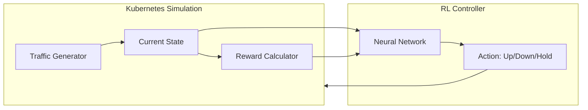

# Eco-Scale RL — System Architecture Guide

This document explains the technical "under the hood" logic of your project to help you prepare for your defense.

## 1. The High-Level Architecture
The project follows the standard **Agent-Environment Loop**. In our case:
- **Environment**: A simulated Kubernetes cluster.
- **Agent**: The RL brain making scaling decisions.

---

## 2. How the Environment Works (`KubernetesEnv`)
The environment is a discrete-time simulation ($T = 5$ minutes per step).

### A. Traffic Generation (The "Input Force")
We simulate two types of traffic:
1. **Cyclical**: A sine wave representing daily usage (high during the day, low at night).
2. **Burst**: Random "spikes" added to the sine wave to test the agent's resilience.

### B. System Dynamics
When the agent chooses an action:
1. **Pod Update**: `self.pod_count` increases, decreases, or stays the same.
2. **Latency Calculation**: 
   $$\text{Latency} = \frac{\text{Request Queue}}{\text{Pod Count} \times \text{Capacity}}$$
   If pods are too few, latency hits 1.0 (100% delay).
3. **Queue Update**: Requests arrive based on traffic and are processed based on pods.

---

## 3. The "Brain" Architecture
All three algorithms share a similar **Neural Network (MLP)** structure:
- **Input Layer (4 nodes)**: Receives the 4 state variables.
- **Hidden Layers (2x64 nodes)**: Learns complex patterns (e.g., "If it's 8:00 AM and queue is growing, scale up now!").
- **Output Layer (3 nodes)**: Predicts the value/probability of [Scale Down, Hold, Scale Up].

### Algorithm-Specific Logic:
- **DQN (Value-Based)**: Predicts **Q-Values**. It asks: *"What is the total future reward if I scale up right now?"* It picks the action with the highest Q-value.
- **PPO/REINFORCE (Policy-Based)**: Predicts **Probabilities**. It learns a distribution (e.g., 80% chance to Scale Up, 15% to Hold, 5% to Scale Down).

---

## 4. The Reward Function (The Strategy)
This is how we "teach" the agent. We balance four priorities:
1. **Latency Penalty (α=0.5)**: The most important metric—ensures user experience. 
2. **Resource Waste (β=0.3)**: Penalizes over-provisioning (energy efficiency).
3. **Scaling Stability (γ=0.05)**: Reduced from 0.2 to 0.05 to allow the agent to be more proactive.
4. **Latency Improvement Bonus (+0.3)**: A positive reward given when the agent reduces queue length step-over-step.

**Termination Penalty (-10.0)**: Applied if latency stays at 1.0 for more than 3 steps (SLA catastrophe).

---

## 5. Why did DQN perform best?
In our results, **DQN Run 6** achieved the best stability (-12.21 ± 0.10). 

1. **Discrete Actions**: DQN is natively designed for discrete choices (Up/Down/Hold).
2. **Experience Replay**: It "remembers" past traffic spikes, which is crucial for handling the 24-hour cyclical nature of our environment.
3. **Target Networks**: By updating the target network slowly (every 500 steps), we reduced "chasing its own tail" syndrome, leading to the most stable policy across all 3 algorithms.
