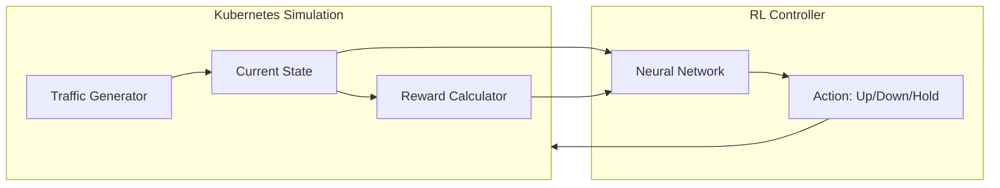

# Eco-Scale RL — System Architecture Guide

This document explains the technical "under the hood" logic of your project to help you prepare for your defense.

## 1. The High-Level Architecture
The project follows the standard **Agent-Environment Loop**. In our case:
- **Environment**: A simulated Kubernetes cluster.
- **Agent**: The RL brain making scaling decisions.


```mermaid
graph LR
    subgraph Environment [Kubernetes Simulation]
        Traffic[Traffic Generator] --> State[Current State]
        State --> Reward[Reward Calculator]
    end

    subgraph Agent [RL Controller]
        NN[Neural Network] --> Decision[Action: Up/Down/Hold]
    end

    Decision --> Environment
    State --> NN
    Reward --> NN
```

---

## 2. How the Environment Works (`KubernetesEnv`)
The environment is a discrete-time simulation ($T = 5$ minutes per step).

### A. Traffic (The "Input Force")
The load is **replayed from real Alibaba 2018 cluster traces** — not synthetic. The raw CPU-utilization
series is resampled to 5-minute steps and sliced into 13 daily traces of 288 steps each; every episode
replays one trace, and multi-trace training samples a random trace per episode. The traces carry the
real daily cycle (busy days, quiet nights) and real bursts, so the agent learns on genuine cluster
behaviour rather than a hand-made sine wave. The 13 traces are split **8 train / 5 test** (test held out).

### B. System Dynamics
When the agent chooses an action:
1. **Pod Update**: `self.pod_count` increases, decreases, or stays the same.
2. **Latency Calculation**: 
   $$\text{Latency} = \frac{\text{Request Queue}}{\text{Pod Count} \times \text{Capacity}}$$
   If pods are too few, latency hits 1.0 (100% delay).
3. **Queue Update**: Requests arrive based on traffic and are processed based on pods.

---

## 3. The "Brain" Architecture
All three algorithms share a similar **Neural Network (MLP)** structure:
- **Input Layer (4 nodes)**: Receives the 4 state variables.
- **Hidden Layers (2x64 nodes)**: Learns complex patterns (e.g., "If it's 8:00 AM and queue is growing, scale up now!").
- **Output Layer (3 nodes)**: Predicts the value/probability of [Scale Down, Hold, Scale Up].

### Algorithm-Specific Logic:
- **DQN (Value-Based)**: Predicts **Q-Values**. It asks: *"What is the total future reward if I scale up right now?"* It picks the action with the highest Q-value.
- **PPO/REINFORCE (Policy-Based)**: Predicts **Probabilities**. It learns a distribution (e.g., 80% chance to Scale Up, 15% to Hold, 5% to Scale Down).

---

## 4. The Reward Function (The Strategy)
This is how we "teach" the agent. The reward balances service quality against energy cost:

```
reward = −W_LAT·latency − W_ENERGY·(pods / MAX_PODS) − W_SLA·breach − W_SCALE·scaling
```

| Term | Weight | Meaning |
|---|---|---|
| Latency penalty (`W_LAT`) | 1.0 | penalizes high utilization / slow service |
| Energy per pod (`W_ENERGY`) | 1.5 | charged on the **absolute** pod count — this is what makes right-sizing (not over-provisioning) optimal |
| SLA breach (`W_SLA`) | 1.0 | hard penalty when utilization saturates (≥ 1.0) |
| Scaling cost (`W_SCALE`) | 0.02 | small per-action cost to discourage thrashing |

The "right-sized" reference is the pod count that holds utilization at a healthy **70%** (`UTIL_TARGET`).
There is **no hard-termination penalty** — saturation is handled entirely through the breach term. The
reward was validated offline (`reward_design.py`) before training: a demand-tracking policy scores
**−348.5** versus **−500.7** for an over-provisioning ("park-high") policy, confirming it rewards
right-sizing rather than over-provisioning.

---

## 5. Why did PPO win?
Across a 10-run hyperparameter sweep per algorithm (on the 8 train traces), the champion is **PPO run 6**
(larger batch) at **−340.07 ± 10.24** mean test reward — the best score of any run across all three
algorithms. The overall ranking is **PPO > DQN > REINFORCE**.

1. **Stability**: PPO's clipped objective keeps each update close to the previous policy, so its entire
   sweep stayed in a tight band (−351 … −340) with **no collapses**. DQN, by contrast, had runs blow up
   to ≈ −480/−489 (larger buffer, aggressive exploration), and REINFORCE's no-baseline run collapsed to
   −403.
2. **Low-variance updates**: the actor-critic baseline gives PPO lower-variance gradients than
   REINFORCE's raw Monte-Carlo returns, so it reaches a better policy on the same training budget.
3. **Deployment robustness**: PPO landed on its operating point without per-run babysitting — the
   quality that matters for a controller you would actually ship. DQN's best run (baseline, −344.58) is
   statistically comparable, but its sensitivity to hyperparameters made it the riskier choice.

*(These are multi-trace test-reward figures on the recalibrated reward; they are **not** comparable to
earlier single-trace numbers on the −12 scale.)*
